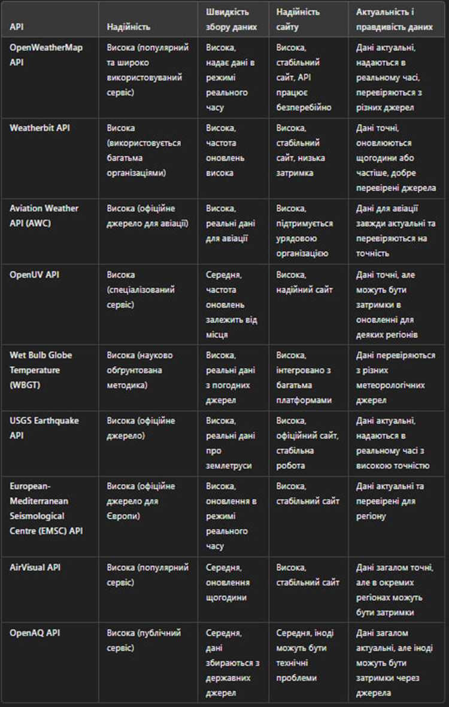

У минулому семестрі ми з вами обговорювали тему магістерської роботи, і ви пояснювали, що сенс магістерської роботи полягає в тому, щоб студенти показали, що вміють досліджувати певні аспекти. Тобто, сенс бакалаврської роботи полягає в тому, щоб показати, що ми вміємо писати код, а магістерської — аналізувати і досліджувати.

Саме тому при презентації роботи я думаю роботи опору моїх досліджень на такі речі: 
1) було проаналізовано які зовнішні фактори впливають на здоров'я людини
2) було проаналізовано норми для кожного параметру
3) було досліджено різні АПІ
4) досліджено серед мов програмування, найбільш яка підходить для розв'язку задачі

Тепер детальніше по кожному пункту

## 1) Які зовнішні фактори впливають на здоров'я людини

Обгрунтувати та навести статті, що саме обранні мною параметри дійсно впливають на якість життя 
(умовно це буде 2 слайди презентації) 1 - я детально описую 1-2 пункти наприклад ультрафіолетове випромінювання, та температуру 
з відповідними посиланнями на статті
2 - список статтей для інших показників (щоб не забирати занадто багато часу)

## 2) Норми для кожного параметру
те саме як по минулому пункту, тобто беру ті ж 2 показники та обгрунтовую, чому саме такі норм були обрані посилаючись на статті

## 3) АПІ
можна на слайді показати табличку:

де якраз я показую, що обрав найкращі варіанти

## 4) Оптимальна мова програмування 
пункт ще не готовий, поясню його сенс:
коли ми узгодимо що на джаві все готово то я напишу такий самий функціонал на Python та C# і буду аналізувати по критеріям
наприклад: швидкість/надійність/вага (скільки вважить проект на обраній мові) і тд

і наприклад якщо джава найкраща, то обираємо її

Далі за необхідністю, можу написати веб-сторінку для моєї програми, щоб зруніше демонструвати її роботу 
(сильно акцентувати на цей пункт не бачу сенсу, бо це буде демонстрація ''вміння писати код'')

---
на даний момент по яким показникам я вичісляю придатне чи певне місце для життя

* температура
* атмосферний тиск
* вологість
* уф-випромінювання
* якість повітря

---

---
з обраних мою апі можна використовувати ще такі параметри:

* Швидкість вітру
* Інтенсивність опадів
* Озоновий шар
* Час експозиції УФ-випромінювання (можна  визначити, скільки часу людина може безпечно перебувати під сонцем без ризику отримання опіків)
* PM2.5 і PM10 (частки з діаметром до 2.5 мкм і 10 мкм) (ці частки можуть проникати глибоко в легені і викликати респіраторні або серцево-судинні проблеми)
* Концентрація оксидів азоту
* Концентрація діоксиду сірки
* Концентрація оксиду вуглецю
* Озон на поверхні землі
* Інтенсивність сонячного випромінювання
---

# По наявному коду
Код попередній, буде звісно змінюватись в залежності від ремарок.

**Показники для Києва** : lat - 50.4501, lon - 30.5234 (Занадто висока вологість)

Його результати(станом на 07.10.2024 19:31):

  
Натисніть для розкриття JSON

{
    "message": "Місце не придатне для життя: Занадто висока вологість.",
    "indicators": [
        {
            "name": "Температура",
            "status": "Хороший",
            "description": "Температура в межах норми."
        },
        {
            "name": "Атмосферний тиск",
            "status": "Хороший",
            "description": "Тиск в межах норми."
        },
        {
            "name": "Вологість",
            "status": "Негативний",
            "description": "Занадто висока вологість."
        },
        {
            "name": "УФ-випромінювання",
            "status": "Хороший",
            "description": "УФ рівень в межах норми."
        },
        {
            "name": "Якість повітря",
            "status": "Хороший",
            "description": "Якість повітря в нормі."
        }
    ],
    "safe": false
}

**Показники для Чернівців** : lat - 48.2908, lon - 25.9346 (в межах норми)

Його результати(станом на 07.10.2024 19:40):

  
Натисніть для розкриття JSON

{
    "message": "Місце придатне для життя",
    "indicators": [
        {
            "name": "Температура",
            "status": "Хороший",
            "description": "Температура в межах норми."
        },
        {
            "name": "Атмосферний тиск",
            "status": "Хороший",
            "description": "Тиск в межах норми."
        },
        {
            "name": "Вологість",
            "status": "Хороший",
            "description": "Вологість в нормі."
        },
        {
            "name": "УФ-випромінювання",
            "status": "Хороший",
            "description": "УФ рівень в межах норми."
        },
        {
            "name": "Якість повітря",
            "status": "Хороший",
            "description": "Якість повітря в нормі."
        }
    ],
    "safe": true
}

**Показники для Джакарти**: lat - -6.2088, lon - 106.8456 (небезпечний рівень УФ та забруднене повітря)

Його результати(станом на 07.10.2024 19:43):

  
Натисніть для розкриття JSON

{
    "message": "Місце не придатне для життя: Небезпечний рівень УФ., Повітря занадто забруднене.",
    "indicators": [
        {
            "name": "Температура",
            "status": "Хороший",
            "description": "Температура в межах норми."
        },
        {
            "name": "Атмосферний тиск",
            "status": "Хороший",
            "description": "Тиск в межах норми."
        },
        {
            "name": "Вологість",
            "status": "Хороший",
            "description": "Вологість в нормі."
        },
        {
            "name": "УФ-випромінювання",
            "status": "Негативний",
            "description": "Небезпечний рівень УФ."
        },
        {
            "name": "Якість повітря",
            "status": "Негативний",
            "description": "Повітря занадто забруднене."
        }
    ],
    "safe": false
}

# Запитання
Отож мені потрібно почути від вас 
1. Чи достатньо моїх 4 пунктів дослідження?
2. Чи використувати додаткові параметри (які я описав вище), якщо так, то які? 

# Подальші мої дії 
Якшо все више перераховане вас влаштовує, то я буду виправляти можливі ремарки, підчистити цей проект, і братись реалізовувати подібний функціонал на інших мова програмування.
Далі напишу базовий веб, і буду вже вам демонструвати.
# healty-indicators

